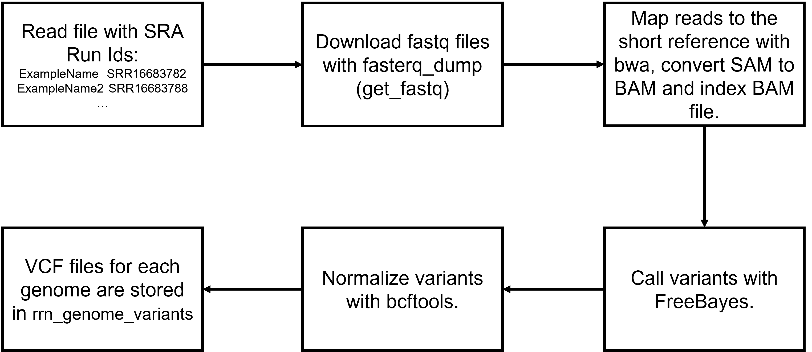

This Snakemake pipeline is designed to determine SNP copy number at sites 2058, 2059, 2611 in 23S rRNA gene in N. gonorrhoeae genome. The algorithm to determine SNP copy number is described in https://doi.org/10.1016/j.ijantimicag.2016.10.023. Briefly:<br>
1) Raw reads are mapped to a shortened version of a reference genome (3 copies of rrn operons are deleted);<br>
2) A variant caller detects SNPs at given positions on mapped reads;<br>
3) Copy number is calculated from the % of alternative reads: % of alternative reads is rounded to the nearest quartile and from that we can assume that 0 % = 0 copies, 25% = 1 copy, 50 % = 2 copies, 75% = 3 copies, 100% = 4 copies.<br>

As a reference genome WHO_F_2024 (GenBank: GCA_040383235.1) was chosen since this N. gonorrhoeae strain has no mutations at sites 2058, 2059, 2611. Genome editing, i.e. rrn copy deletion and obtainig of a reverse-complement sequence (since originally all rrn operons were on the "-" strand), was carried out in `genome_editing.ipynb`. The full reference genome is located in `ref_full_genome` and the shortened reference genome is located in `ref_short_genome`.<br>

The main pipeline file is called `Snakefile` and its flowchart can be seen below:<br>
<br>
To configure the pipeline there is `config.yaml`:
```yaml
file_with_genomes: test_genomes.txt
get_fastq_threads: 4
bwa_map_short_threads: 4
normalize_short_variants_threads: 1
```
Here you can specify which file to use for reading SRA Run Ids with `file_with_genomes`, how many threads to use for each operation with `get_fastq_threads, bwa_map_short_threads, normalize_short_variants_threads` (it's a good idea to assign more threads to get_fastq_threads and bwa_map_short_threads as these steps are the longest).<br>
Your input file for the Snakemake pipeline should look like this (columns are separated with a tab):
```
human_redable_name_1	SRR00000000
human_redable_name_2	SRR11111111
...
```
In the left column there are genome names, that will be assigned to vcf files, and in the right column there are SRA Run Ids. An example file is provided (`test_genomes.txt`).<br>
For the pipeline to work make sure that these programs and packages are installed (versions of programs and packages may vary based on future updates):
```
bcftools=1.21
bwa=0.7.19
sra-tools=3.2.1
snakemake=9.5.0
samtools=1.21
freebayes=1.3.9
openpyxl==3.1.5
pandas=2.2.3
```
To start the pipeline you will need to run this command:
```
snakemake --cores n --keep-going
```
Where n is a number of cpu cores that you can let Snakemake use. `--keep-going` option prevents pipeline interruption when errors occur (this way after the pipeline finishes you can start it again to finish the jobs that were not finished).<br>
When the pipeline finishes you can run a python script `vcf_reading.py` which will output an Excel table `results.xlsx`. The table will look like this:<br>
| genome_name | 2611 | 2611_num | 2611_reads_% | 2058 | 2058_num | 2058_reads_% | 2059 | 2059_num | 2059_reads_% |
|:-----------:|:----:|:--------:|:------------:|:----:|:--------:|:------------:|:----:|:--------:|:------------:|
|470          |C     |4         | 100          | A    |     4    |     100      |  A   |   4      |          100 |
|3758         |T     |2         |50.09208103   | A    |4         |100           |  A   |4         |100           |
|4728         |C     |4         |100           |G     |2         |52.69565217   |A     |4         |100           |
|...          |...   |...       |...           |...   |...       |...           |...   |...       |...           |
* genome_name - genome name specified in the left column of the input file;<br>
* 2611/2058/2059 - nucleotide found in this position;<br>
* 2611_num/2058_num/2059_num - copy number of the nucleotide in this position;<br>
* 2611_reads_%/2058_reads_%/2059_reads_% - % of reads supporting nucleotide at this position.<br>
To test whether the pipeline works correctly you can delete the folder `rrn_genome_variants` and start the pipeline with the input file `test_genomes.txt`. Then you should run python script `vcf_reading.py` and get the file `results.xlsx`. If `results.xlsx` looks the same as `results_example.xlsx` then everything works correctly.
